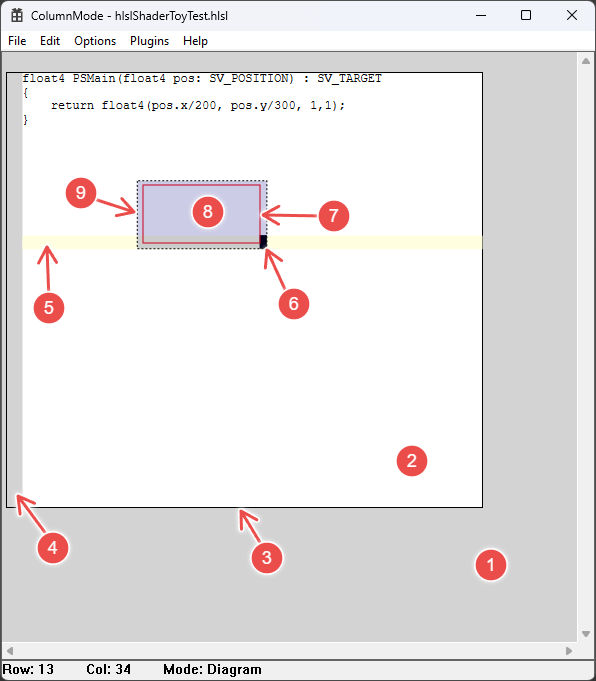

# Themes
Themes allow you to style ColumnMode's color pallet to suit your taste / usage.
You can find the Themes installed on your system at `%APPDATA%/ColumnMode/Themes` (extension is `.cmt`).
`.cmt` files are a JSON format pairing colors to theme Ids.
Opening a `.cmt` file in ColumnMode will allow you to preview your changes in realtime (though some fields are not used by the editor when viewing `.cmt` files. Eventually this may be addressed by a more full-featured theme editor).

You can create a new Theme by going to Options > Themes > Create New Theme.
Your new theme will be based on the default theme: ColumnModeClassic. 

## Theme Ids
You can think of a theme as a pallet of colors that can be picked from by the Column Mode editor for different uses.

### `UI_`* Theme Ids

1. `UI_BACKGROUND`: The empty region of the window that can't be edited.
1. `UI_PAPER`: The region available for editing.
1. `UI_PAPER_BORDER`
1. `UI_MARGIN`
1. `UI_CURRENT_LINE_HIGHLIGHT`: A color that should be different from `UI_PAPER` to indicate the line bing edited.
1. `UI_CARET`: The flashing indicator for the character you are about to edit.
1. `UI_DRAG_RECT`: The solid line that shows the exact selection rectangle you are dragging out.
1. `UI_SELECTION`: The shaded region of your selection.
1. `UI_SELECTION_BORDER`: The "marching ants" on the ourside of the effective selection rectangle.

### `TEXT_`* Theme Ids
Most of these aren't used yet.
For now just edit `TEXT_DEFAULT` to set the color of the text.
Other `TEXT_`* colors will be used in the future when plugins are able to handle text colorization.